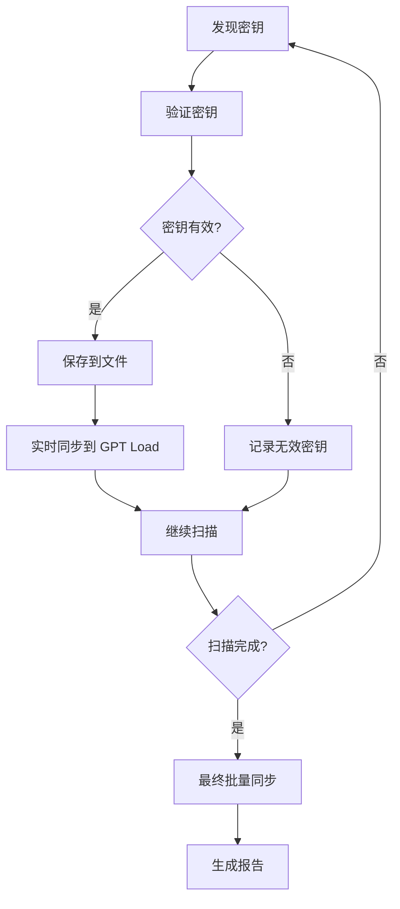

# GPT Load 同步功能修复文档

## 问题描述

用户报告系统没有将找到的密钥同步到 GPT Load 服务，即使已经在 `.env` 文件中配置了相关参数：

```env
GPT_LOAD_SYNC_ENABLED=true
GPT_LOAD_URL=http://45.32.71.57:3000
GPT_LOAD_AUTH=sk-123456
GPT_LOAD_SMART_GROUP_ENABLED=true
```

## 问题原因

经过代码审查，发现 `app/core/orchestrator_v2.py` 中存在以下问题：

1. **缺少 SmartSyncManager 集成**：虽然系统有 `SmartSyncManager` 组件，但 `OrchestratorV2` 没有调用它
2. **缺少实时同步逻辑**：在验证密钥后，只保存到文件，没有同步到 GPT Load
3. **缺少最终批量同步**：在运行结束时，没有将所有收集的密钥批量同步

## 解决方案

### 1. 导入必要的模块

```python
from utils.smart_sync_manager import smart_sync_manager, KeyType
```

### 2. 初始化同步管理器

在 `OrchestratorV2.__init__` 中添加：

```python
# 初始化智能同步管理器
self.sync_manager = smart_sync_manager
self.gpt_load_enabled = get_config_service().get("GPT_LOAD_SYNC_ENABLED", False)
if self.gpt_load_enabled:
    logger.info("✅ GPT Load sync enabled")
```

### 3. 实时同步密钥

在 `_process_item` 方法中，当发现有效密钥时立即同步：

```python
if val_result.is_valid:
    # ... 保存密钥到文件 ...
    
    # 同步到 GPT Load
    if self.gpt_load_enabled:
        self._sync_key_to_gpt_load(val_result.key, status)
```

### 4. 实现同步方法

添加 `_sync_key_to_gpt_load` 方法：

```python
def _sync_key_to_gpt_load(self, key: str, status: KeyStatus):
    """同步单个密钥到 GPT Load"""
    try:
        # 根据状态确定密钥类型
        if status == KeyStatus.VALID_FREE:
            key_type = KeyType.FREE
            keys_dict = {KeyType.FREE: [key]}
        elif status == KeyStatus.VALID_PAID:
            key_type = KeyType.PAID
            keys_dict = {KeyType.PAID: [key]}
        elif status == KeyStatus.RATE_LIMITED:
            key_type = KeyType.RATE_LIMITED
            keys_dict = {KeyType.RATE_LIMITED: [key]}
        else:
            return
        
        # 使用智能同步管理器同步
        if self.sync_manager.enabled:
            self.sync_manager.batch_sync_with_types(keys_dict)
            logger.info(f"🔄 Key synced to GPT Load (smart group): {mask_key(key)}")
        else:
            from utils.sync_utils import sync_utils
            sync_utils.add_keys_to_queue([key])
            logger.info(f"🔄 Key synced to GPT Load (traditional): {mask_key(key)}")
            
    except Exception as e:
        logger.error(f"Failed to sync key to GPT Load: {e}")
```

### 5. 最终批量同步

在 `_finalize_run` 方法中添加批量同步：

```python
def _final_sync_to_gpt_load(self, keys_by_status: Dict):
    """最终批量同步所有密钥到 GPT Load"""
    try:
        logger.info("🔄 Final sync to GPT Load...")
        
        # 准备各类型密钥
        valid_free_keys = keys_by_status.get(KeyStatus.VALID_FREE.name, [])
        valid_paid_keys = keys_by_status.get(KeyStatus.VALID_PAID.name, [])
        rate_limited_keys = keys_by_status.get(KeyStatus.RATE_LIMITED.name, [])
        
        # 使用智能同步管理器
        success = self.sync_manager.sync_to_gpt_load(
            valid_keys=valid_free_keys,
            rate_limited_keys=rate_limited_keys,
            paid_keys=valid_paid_keys,
            free_keys=valid_free_keys
        )
        
        if success:
            total_synced = len(valid_free_keys) + len(valid_paid_keys) + len(rate_limited_keys)
            logger.info(f"✅ Successfully synced {total_synced} keys to GPT Load")
        else:
            logger.error("❌ Failed to sync some keys to GPT Load")
            
    except Exception as e:
        logger.error(f"Failed in final sync to GPT Load: {e}")
```

## 测试验证

创建了 `test_gpt_load_sync.py` 测试脚本，可以验证：

1. **配置检查**：确认所有必要的环境变量已设置
2. **智能同步测试**：测试智能分组功能
3. **直接同步测试**：测试基础同步功能
4. **集成测试**：测试 Orchestrator 中的同步集成

运行测试：

```bash
python test_gpt_load_sync.py
```

## 同步流程

修复后的同步流程如下：



## 智能分组策略

系统支持根据密钥类型自动分组：

- **production 组**：接收所有有效密钥（包括付费和免费）
- **rate_limited 组**：接收 429 限流密钥
- **paid 组**：接收付费密钥
- **free 组**：接收免费密钥

可以通过环境变量配置：

```env
GPT_LOAD_SMART_GROUP_ENABLED=true
GPT_LOAD_GROUP_VALID=production
GPT_LOAD_GROUP_429=rate_limited
GPT_LOAD_GROUP_PAID=paid
GPT_LOAD_GROUP_FREE=free
GPT_LOAD_429_TO_VALID=true  # 将限流密钥也发送到 valid 组作为备份
```

## 日志示例

修复后，运行时会看到以下同步日志：

```
2025-01-11 15:30:45 | INFO | ✅ GPT Load sync enabled
2025-01-11 15:30:50 | INFO | ✅ VALID (VALID_FREE): AIzaSy...
2025-01-11 15:30:50 | INFO | 💾 Key saved to keys_valid_free.txt: AIzaSy...
2025-01-11 15:30:50 | INFO | 🔄 Key synced to GPT Load (smart group): AIzaSy...
2025-01-11 15:31:20 | INFO | 🔄 Final sync to GPT Load...
2025-01-11 15:31:21 | INFO | ✅ Successfully synced 15 keys to GPT Load
```

## 注意事项

1. **确保 GPT Load 服务可访问**：检查 `GPT_LOAD_URL` 是否正确且服务正在运行
2. **验证认证密钥**：确保 `GPT_LOAD_AUTH` 是有效的认证密钥
3. **网络连接**：确保服务器能够访问 GPT Load 服务的网络地址
4. **同步频率**：系统会实时同步发现的密钥，并在运行结束时进行最终批量同步

## 故障排查

如果同步仍然不工作，请检查：

1. 运行测试脚本：`python test_gpt_load_sync.py`
2. 查看日志中是否有错误信息
3. 确认 `.env` 文件中的配置正确
4. 使用 curl 测试 GPT Load 服务是否可访问：
   ```bash
   curl -X GET http://45.32.71.57:3000/health
   ```

## 总结

通过这次修复，系统现在能够：

1. ✅ 实时同步发现的密钥到 GPT Load
2. ✅ 支持智能分组策略
3. ✅ 在运行结束时批量同步所有密钥
4. ✅ 提供详细的同步日志
5. ✅ 支持传统模式和智能模式切换

修复已经集成到 `app/core/orchestrator_v2.py` 中，无需额外配置即可使用。